# Dotfiles
Dotfiles for my build of Arch Linux

## Tools Used
- Terminal: Alacritty
- Window manager: I3
- Panel: Polybar

## Themes
- Blue
  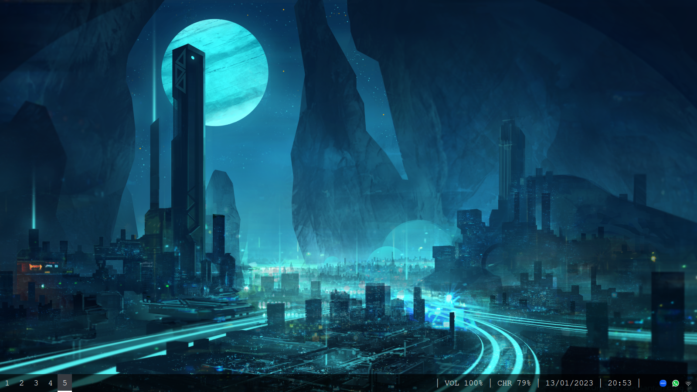
  
  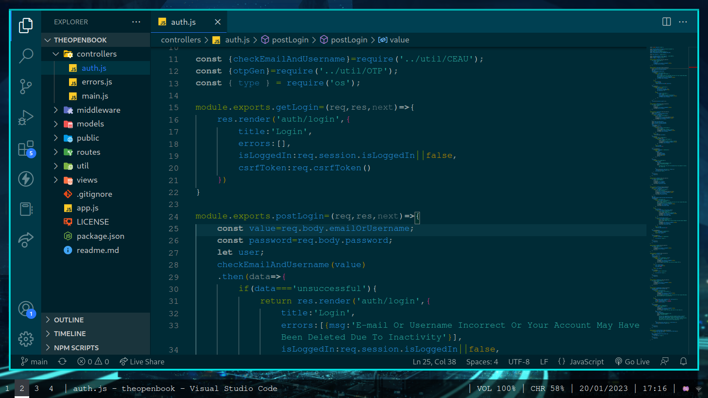
  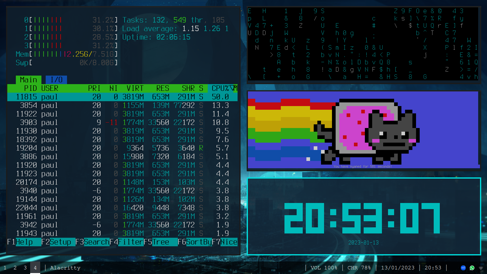

- Green
  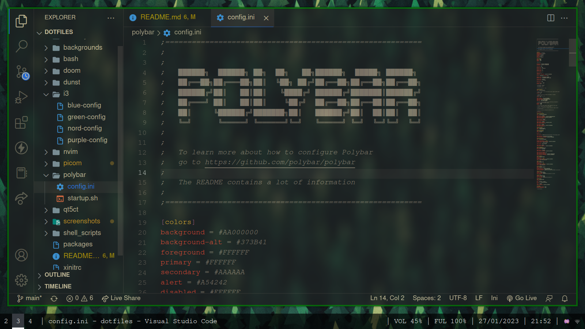
  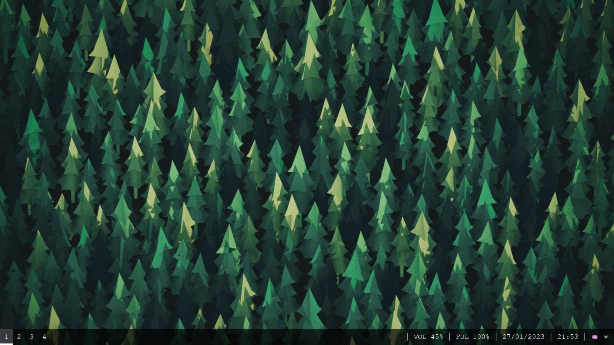
  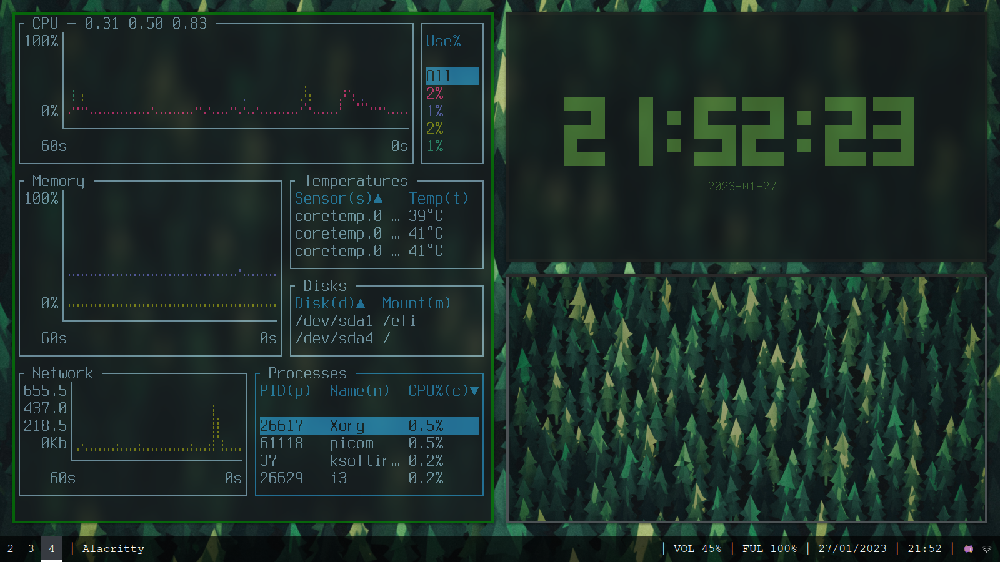
  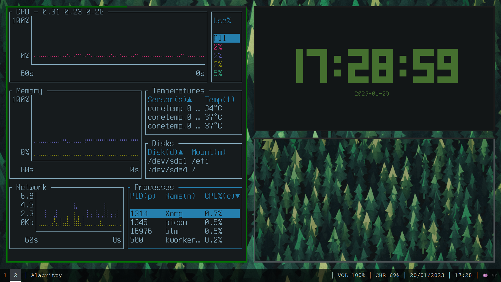
  
- Nord
  
  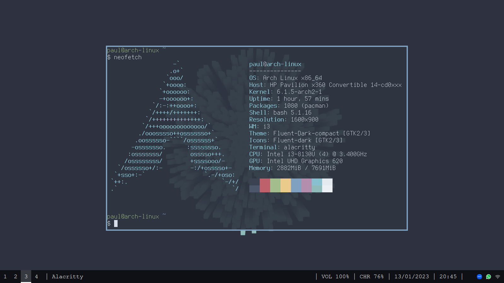
  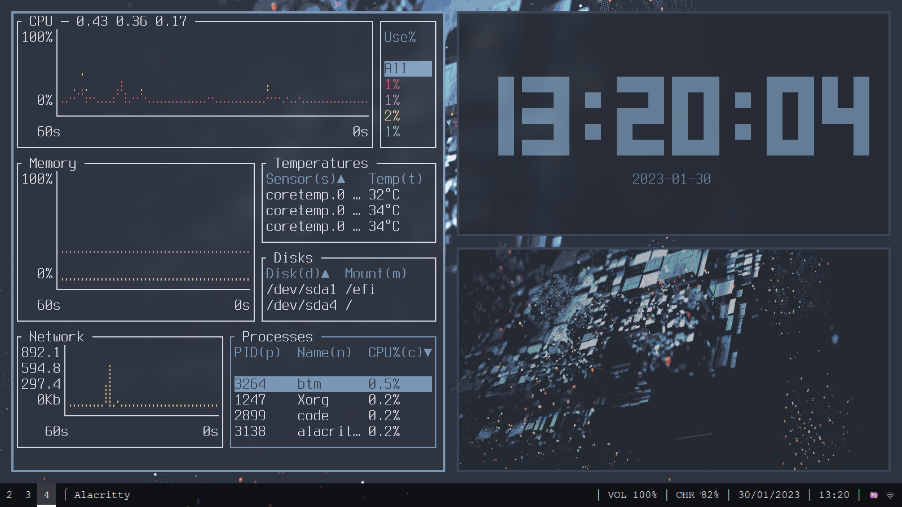
  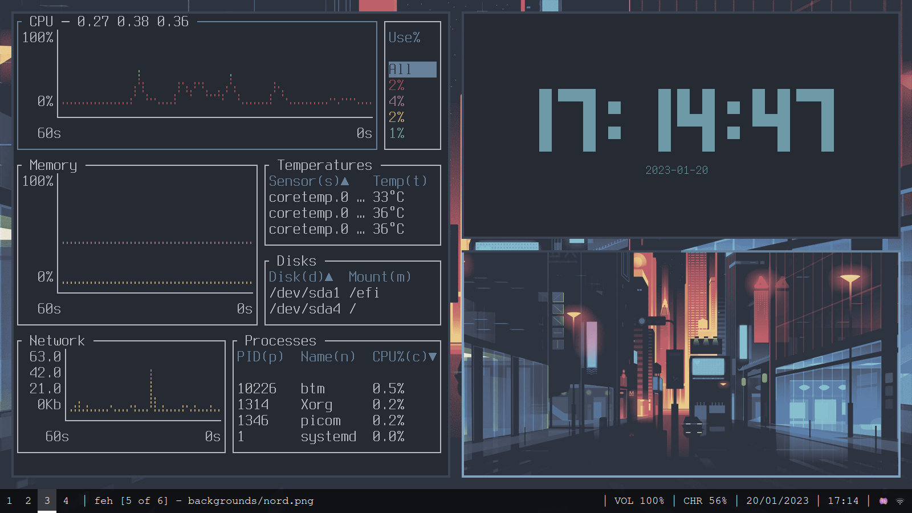
  
- Purple
  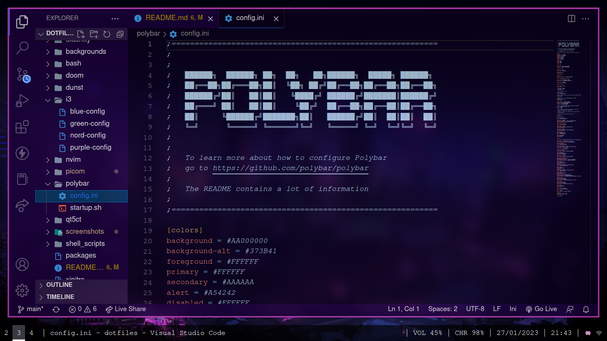
  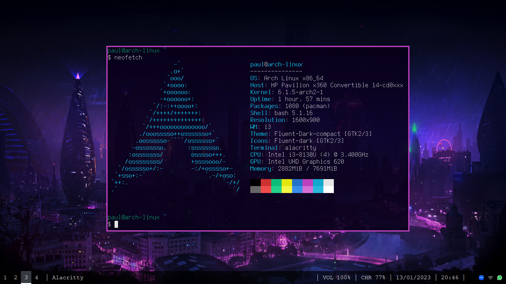
  
  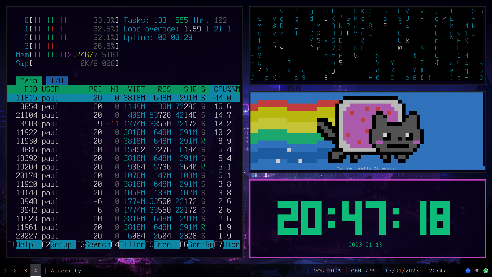
  
